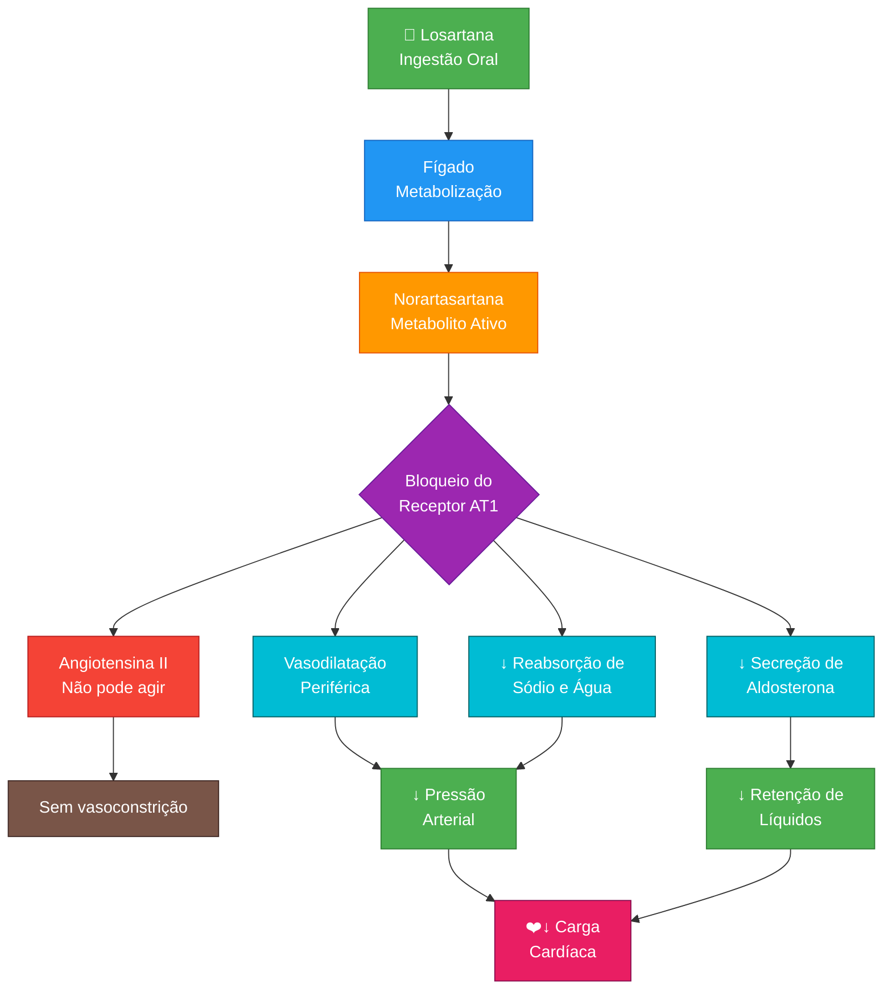

# Mecanismo de Ação da Losartana

## Explicação do Fluxo

| Etapa | Processo | Resultado |
|-------|----------|-----------|
| 1 | Ingestão da Losartana | Absorção no trato gastrointestinal |
| 2 | Metabolização no fígado | Conversão em norartasartana (ativo) |
| 3 | Bloqueio do receptor AT1 | Impede ação da angiotensina II |
| 4 | Vasodilatação | Relaxamento dos vasos sanguíneos |
| 5 | ↓ Aldosterona | Menos retenção de sódio e água |
| 6 | Efeito final | **Redução da pressão arterial** |

## Indicações Clínicas

- ✅ Hipertensão essencial
- ✅ Nefropatia diabética com proteinúria
- ✅ Insuficiência cardíaca
- ✅ Redução de risco de AVC em pacientes com LVH

## Precauções

- ⚠️ **Gravidez**: Contraindicada no 2º e 3º trimestre
- ⚠️ Hipersensibilidade ao princípio ativo
- ⚠️ Pode ocorrer fotossensibilidade
