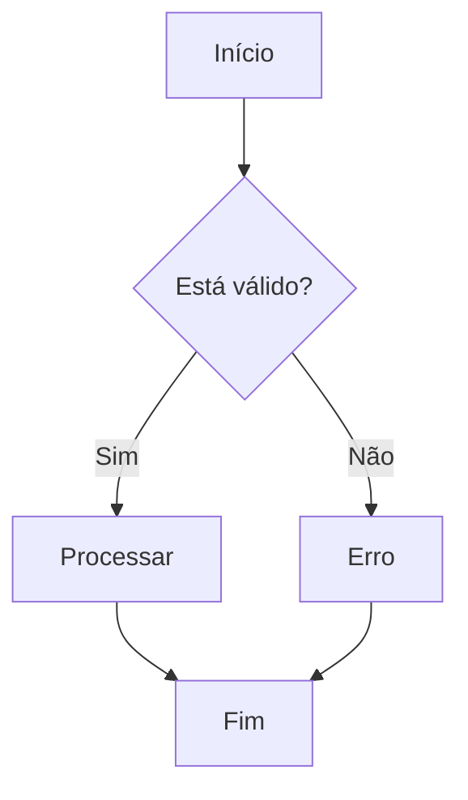
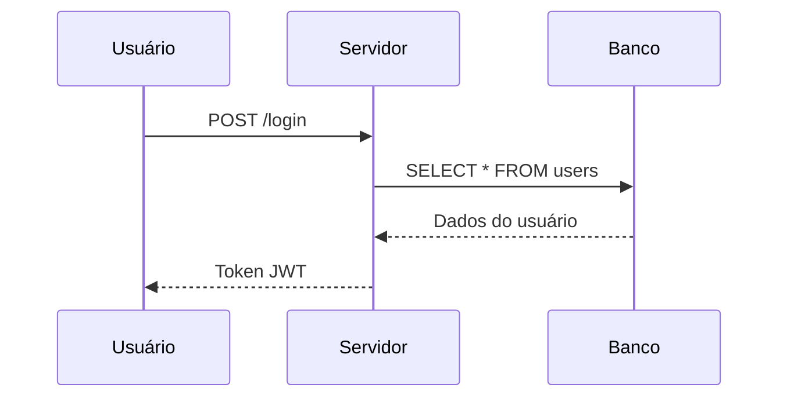
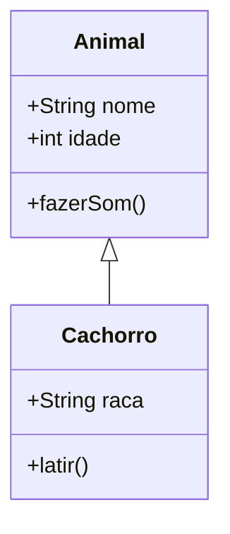
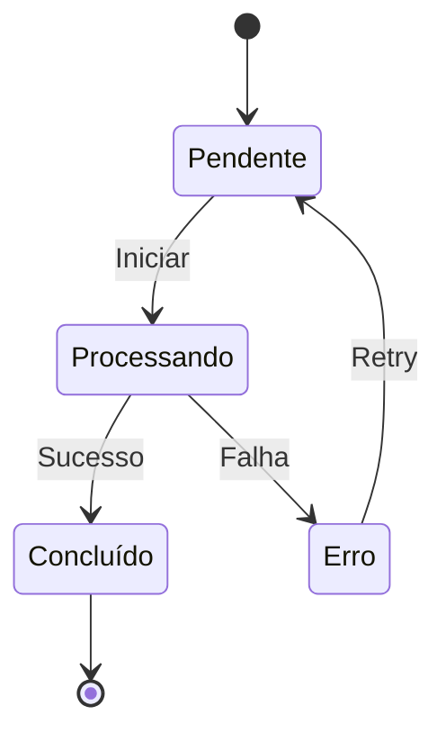
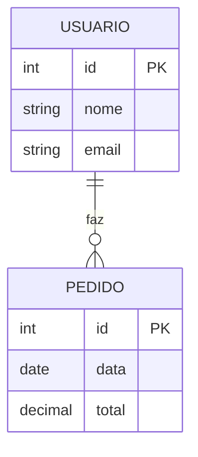
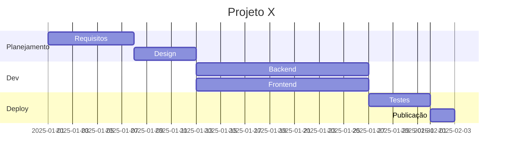
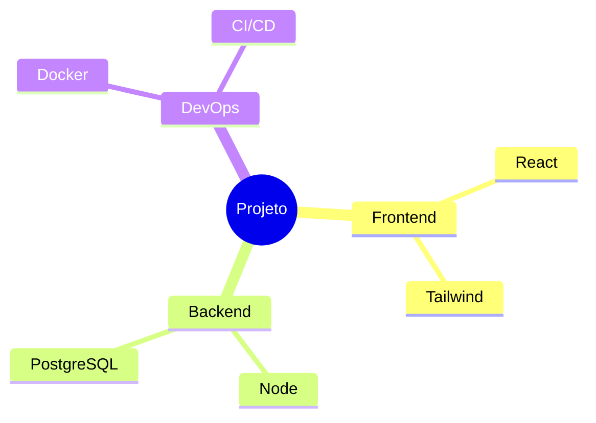
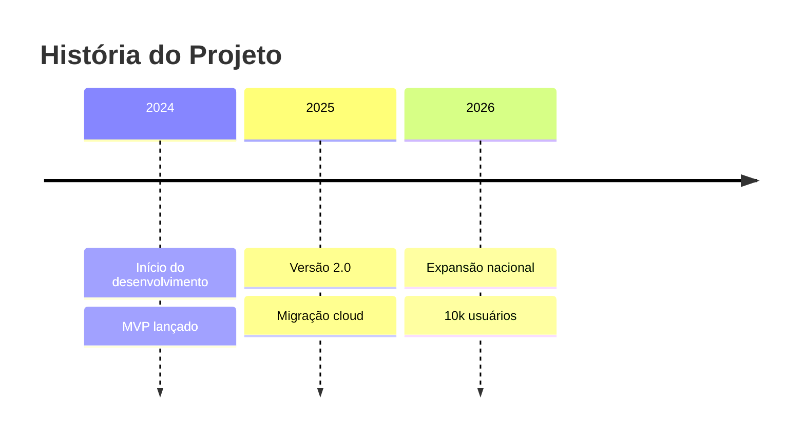
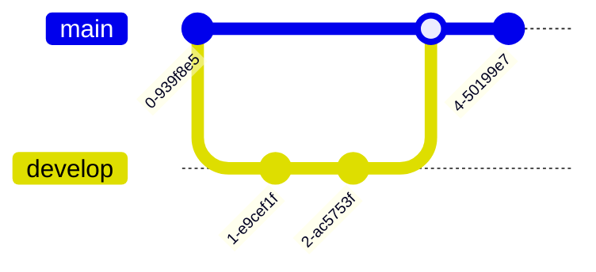

# Mermaid Diagrams Skill

Renderiza diagramas Mermaid para arquivos PNG ou SVG usando `mmdc` (@mermaid-js/mermaid-cli).

## Como usar

1. Escreva o código Mermaid
2. Salve em arquivo `.mmd` (ou passe inline)
3. Use o script `scripts/render-mermaid.ts` para renderizar

### Comando básico

```bash
# A partir de arquivo
bun run Skills/mermaid-diagrams/scripts/render-mermaid.ts diagrama.mmd

# Com opções
bun run Skills/mermaid-diagrams/scripts/render-mermaid.ts diagrama.mmd --output ./saida.png --theme dark --width 1200

# Código inline
bun run Skills/mermaid-diagrams/scripts/render-mermaid.ts "graph TD; A-->B; B-->C" --output ./teste.png
```

### Opções do script

| Opção | Default | Valores |
|-------|---------|---------|
| `--output` | `<nome>.png` | Caminho de saída |
| `--theme` | `default` | `default`, `dark`, `forest`, `neutral` |
| `--format` | `png` | `png`, `svg` |
| `--width` | `800` | Largura em px |
| `--background` | `white` | `white`, `transparent`, `#hex` |
| `--layout` | — | `vertical`, `horizontal` |

## Tipos de diagrama

### Flowchart (Fluxograma)



### Sequence Diagram (Sequência)



### Class Diagram (Classes)



### State Diagram (Estados)



### ER Diagram (Entidade-Relacionamento)



### Gantt (Cronograma)



### Mindmap



### Timeline



### Git Graph



## Layout Vertical

Para forçar diagramas de fluxo em orientação vertical (de cima para baixo), use `--layout vertical` (ou o atalho `--vertical`):

```bash
bun run Skills/mermaid-diagrams/scripts/render-mermaid.ts diagrama.mmd --layout vertical
```

Isso converte automaticamente `graph LR` → `graph TD` e `flowchart LR` → `flowchart TD` no código-fonte antes de renderizar. Funciona tanto para arquivos `.mmd` quanto para código inline.

```bash
# Código inline com layout vertical
bun run Skills/mermaid-diagrams/scripts/render-mermaid.ts "graph LR; A-->B; B-->C" --layout vertical --output ./fluxo.png
```

## Dicas

1. Use `flowchart` em vez de `graph` — é mais moderno e flexível
2. Para fundo escuro, use `--theme dark`
3. Para documentos/SVG, prefira `--format svg` (escalável)
4. `--background transparent` para PNGs sem fundo
5. Evite diagramas com mais de 40 nós — fica difícil de ler
6. Labels com quebra de linha use `<br/>`: `A[Texto<br/>linha 2]`
7. Unicode funciona normalmente: emojis, acentos, etc.

## Referências

- Docs oficial: https://mermaid.js.org/intro/
- Tutorial: https://mermaid.js.org/syntax/flowchart.html
- Live editor: https://mermaid.live