# 🧩 Mermaid Diagrams Skill

Renderiza diagramas Mermaid para PNG ou SVG usando `mmdc` (@mermaid-js/mermaid-cli).

## Referência Rápida

```bash
# Arquivo .mmd -> PNG
bun run Skills/mermaid-diagrams/scripts/render-mermaid.ts diagrama.mmd

# Tema escuro
bun run Skills/mermaid-diagrams/scripts/render-mermaid.ts diagrama.mmd --theme dark

# SVG responsivo
bun run Skills/mermaid-diagrams/scripts/render-mermaid.ts diagrama.mmd --format svg

# Código inline
bun run Skills/mermaid-diagrams/scripts/render-mermaid.ts "graph TD; A-->B" --output fluxo.png

# Lote (todos .mmd da pasta)
bun run Skills/mermaid-diagrams/scripts/render-mermaid.ts *.mmd --output-dir ./diagramas

# Fundo transparente
bun run Skills/mermaid-diagrams/scripts/render-mermaid.ts fluxo.mmd --background transparent
```

## Opções do Script

| Opção | Default | Descrição |
|-------|---------|-----------|
| `--output <path>` | `{nome}.{formato}` | Caminho do arquivo de saída |
| `--output-dir <dir>` | — | Diretório de saída (modo batch) |
| `--theme <tema>` | `default` | Tema: `default`, `dark`, `forest`, `neutral`, `base` |
| `--format <fmt>` | `png` | Formato: `png`, `svg` |
| `--width <px>` | `800` | Largura do viewport |
| `--scale <n>` | `2` | Escala HiDPI (2x para retina) |
| `--background <cor>` | `white` | Fundo: `white`, `transparent`, `#hex` |
| `--layout <dir>` | — | Força direção: `vertical` (TD) ou `horizontal` (LR) |
| `--css <arquivo>` | — | Arquivo CSS para customização |
| `--no-responsive` | — | Desativa correção automática de SVG responsivo |

## Tipos de Diagrama

### 🔀 Flowchart (Fluxograma)

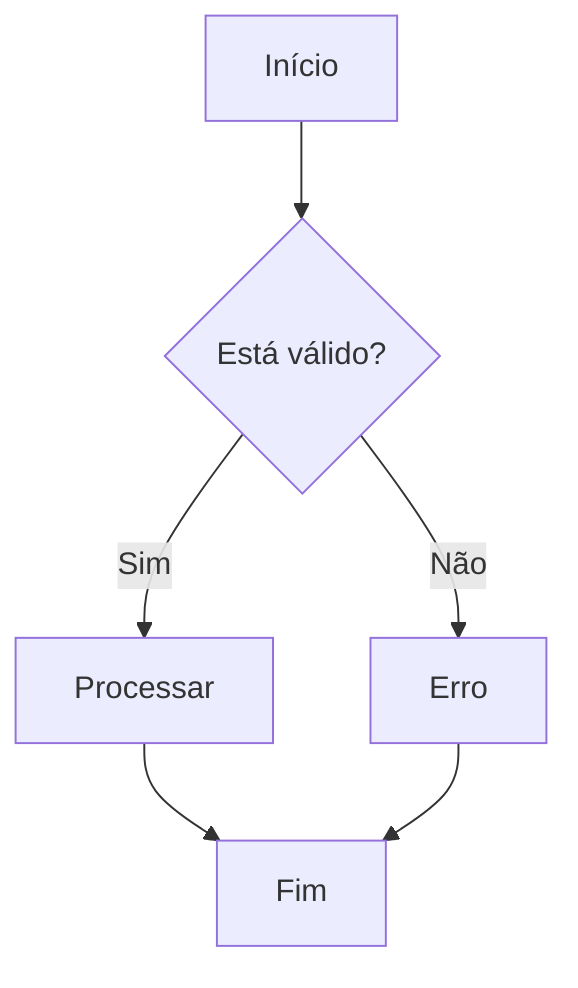

Substitua `flowchart` por `graph` para compatibilidade básica. Use `flowchart` — é mais moderno e flexível.

### 🧑‍💻 Sequence Diagram (Sequência)

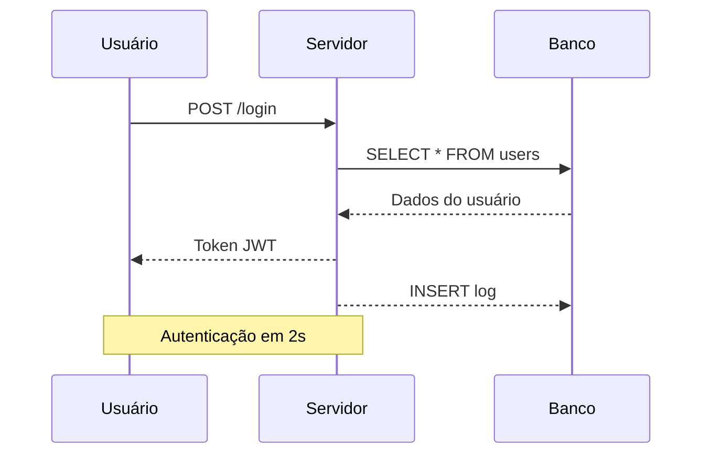

### 🏛️ Class Diagram (Classes)

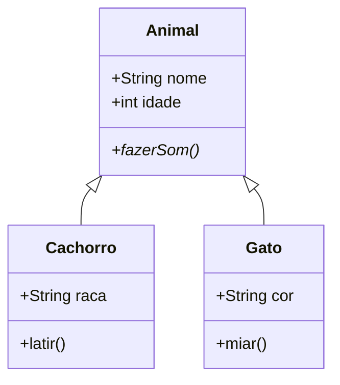

### 🔄 State Diagram (Estados)

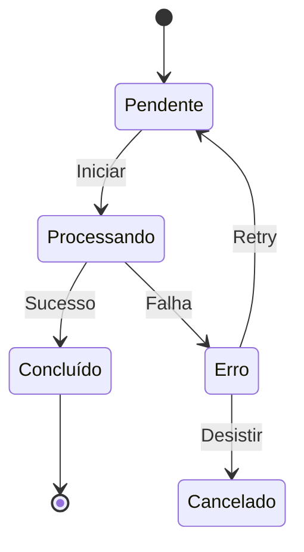

### 🗄️ ER Diagram (Entidade-Relacionamento)

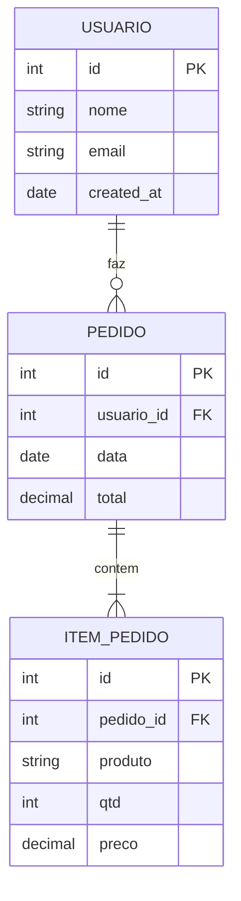

### 📅 Gantt (Cronograma)

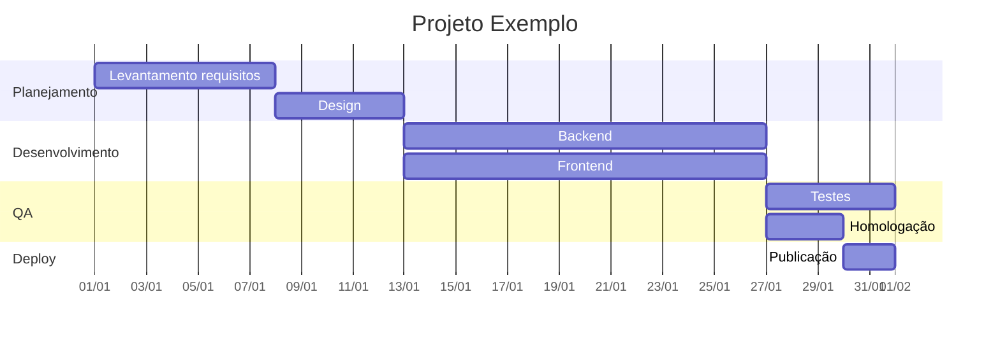

### 🧠 Mindmap

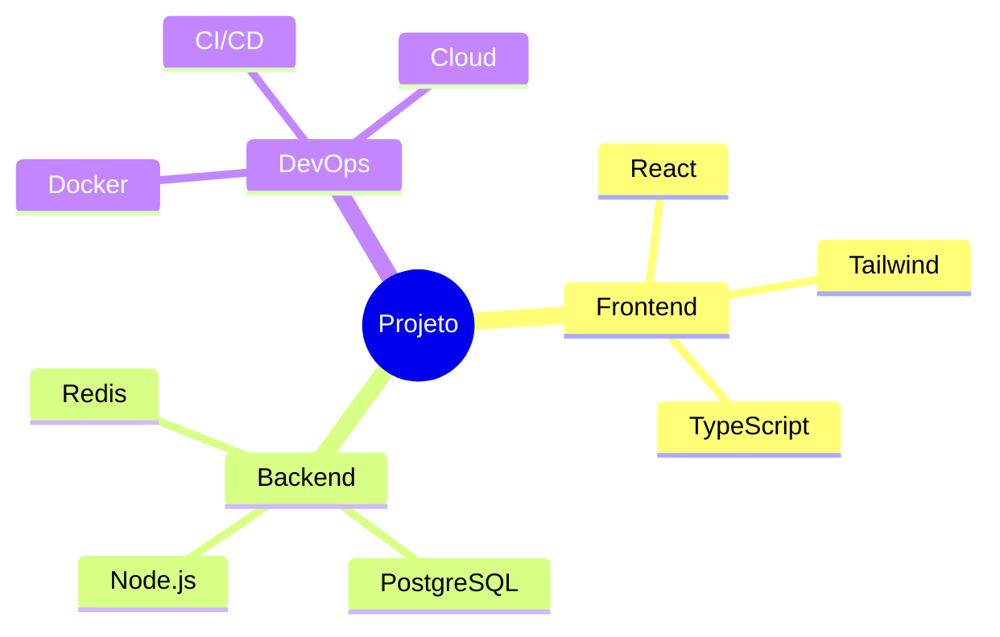

### ⏳ Timeline (Linha do Tempo)

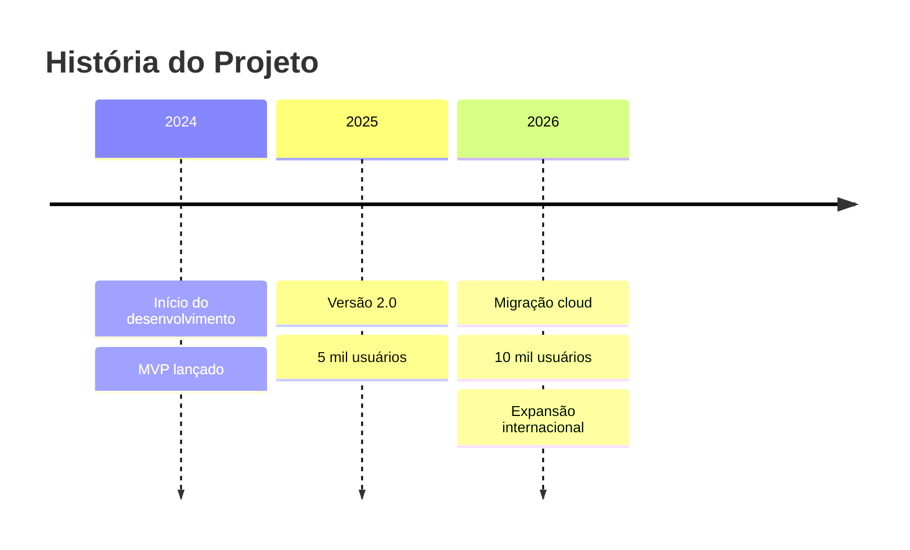

### 🌳 Git Graph

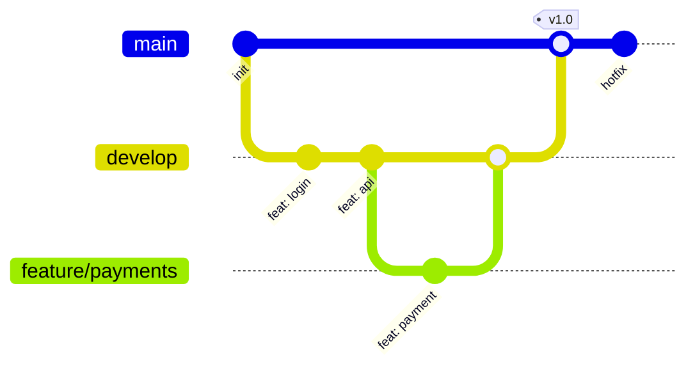

### 🥧 Pie Chart (Pizza)

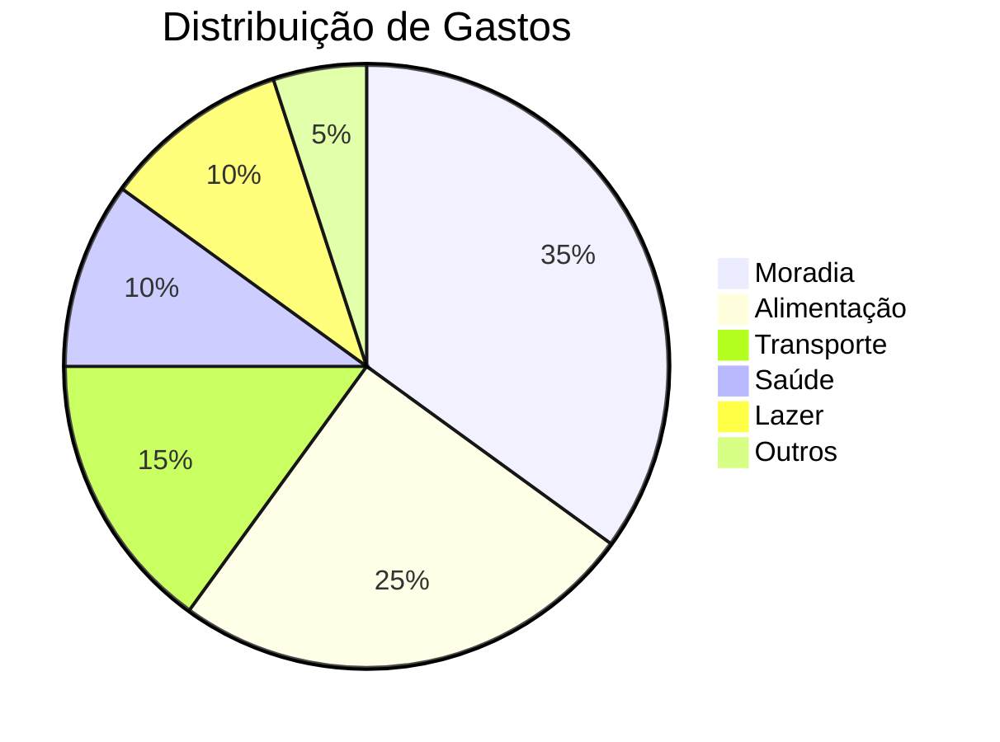

Valores são proporcionais (não precisa somar 100). Útil para budgets, orçamentos e composições.

### 📊 Quadrant Chart

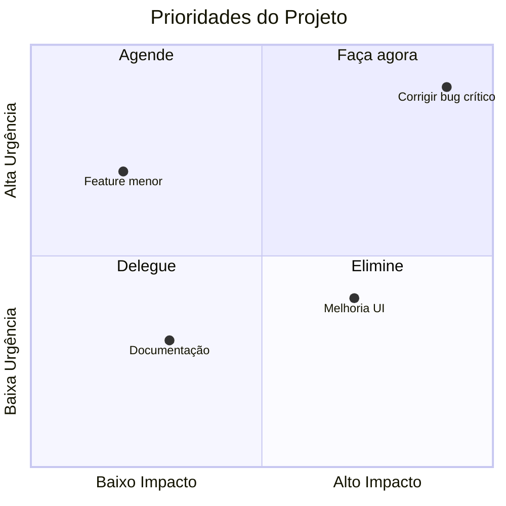

### 📈 XY Chart (Gráfico)

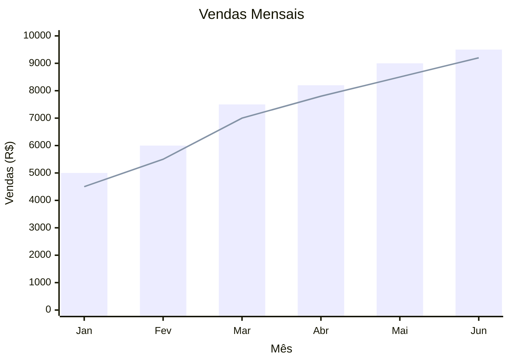

### 🏗️ Block Diagram (Pacotes)

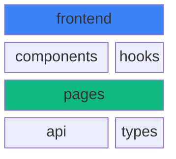

### 📋 Requirement Diagram

```mermaid
requirementDiagram
    requirement req_autenticacao {
        id: REQ-001
        text: Usuário deve fazer login
        risk: medium
        verifymethod: test
    }
    element sistema_login {
        type: system
    }
    req_autenticacao - contains -> sistema_login
```

## Uso Avançado

### Tema Base Customizado

O tema `base` permite controle fino de cores via variáveis:

```bash
bun run render-mermaid.ts diagrama.mmd --theme base
```

Cores que você pode personalizar (edite o script para ajustar): `background`, `primaryColor`, `secondaryColor`, `lineColor`, `textColor`, `fontSize`.

### CSS Customizado

Crie um arquivo `.css` com estilos adicionais:

```bash
bun run render-mermaid.ts diagrama.mmd --css ./meu-estilo.css
```

### Layout Forçado

Útil para garantir orientação consistente em fluxogramas:

```bash
# Força fluxo de cima pra baixo
bun run render-mermaid.ts diagrama.mmd --layout vertical

# Força fluxo horizontal (esquerda pra direita)
bun run render-mermaid.ts diagrama.mmd --layout horizontal
```

### Renderização em Lote

Processe vários arquivos de uma vez:

```bash
# Todos .mmd da pasta atual
bun run render-mermaid.ts *.mmd --output-dir ./imagens --theme dark

# Com nome específico
bun run render-mermaid.ts fluxo_*.mmd --output-dir ./saida --format svg
```

## Dicas

1. **Prefira `flowchart` a `graph`** — mais moderno, mais flexível
2. **Fundo escuro**: use `--theme dark`
3. **Documentos vetoriais**: use `--format svg` — escalável, editável
4. **Sem fundo**: `--background transparent` para sobrepor em outras imagens
5. **Evite > 40 nós** — fica ilegível. Divida em subdiagramas
6. **Labels com quebra de linha**: `<br/>` — `A[Texto<br/>linha 2]`
7. **Emojis e acentos**: funcionam normalmente 😊
8. **Espaços em nomes**: use aspas — `A["Meu Nó"]`

## Troubleshooting

### "mmdc não encontrado"
O script já detecta isso e sugere a instalação:
```bash
npm install -g @mermaid-js/mermaid-cli
```

### Erro "Font not found" no servidor
O Puppeteer pode precisar de fontes. Instale:
```bash
apt-get install -y fonts-noto-color-emoji fonts-dejavu-core
```

### Diagrama renderiza cortado
Aumente `--width` e `--scale`:
```bash
bun run render-mermaid.ts diagrama.mmd --width 1200 --scale 3
```

### SVG não aparece direito no navegador
O script já aplica correção responsiva automaticamente. Se ainda assim出现问题, desative com `--no-responsive` e ajuste manualmente.

### Saída em lote mostra "Nenhum arquivo"
Verifique se o glob corresponde a arquivos existentes. O shell expande `*.mmd` para arquivos .mmd na pasta atual.

## Referências

- [Documentação oficial Mermaid](https://mermaid.js.org/intro/)
- [Sintaxe de Flowchart](https://mermaid.js.org/syntax/flowchart.html)
- [Sintaxe de Sequence](https://mermaid.js.org/syntax/sequenceDiagram.html)
- [Live Editor](https://mermaid.live)
- [Temas e Estilos](https://mermaid.js.org/syntax/theming.html)
